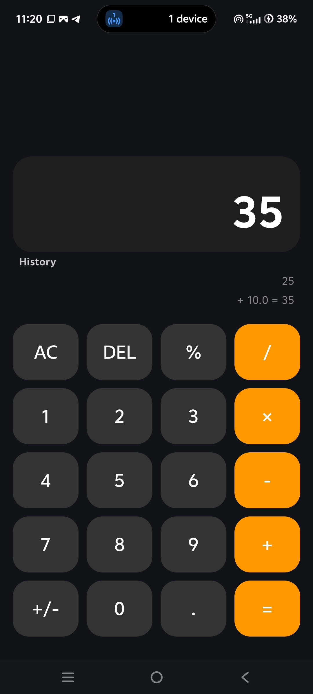
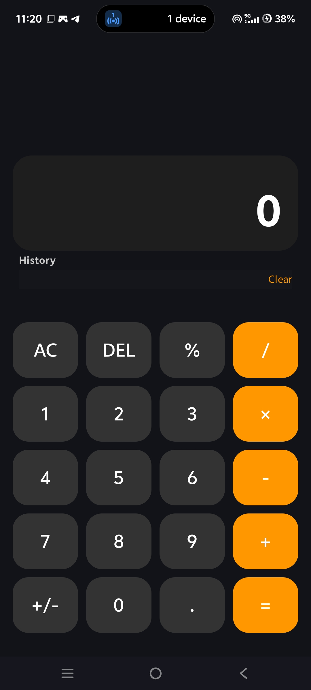

# Calculator App
A simple calculator Android application built using Kotlin and Android Studio.

# Features
- Basic arithmetic calculations
- Addition, substraction, multiplication, division
- Simple and clean user interface
- Easy-to-use calculator buttons

# Technologies Used
- Kotlin
- Android Studio
- Android SDK
  
# Project
This is my first Android application project, created while learning Android development with Kotlin.

# Author
Nancy Gupta

## Screenshot 

### Calculator

